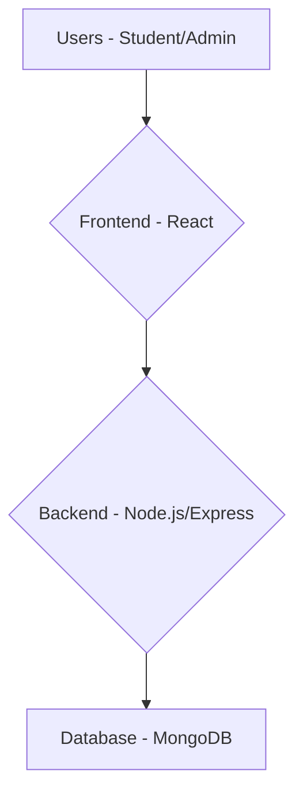

# Plan for Mini-Udemy SaaS Platform

This document outlines the plan for building a free SaaS platform for learning through curated YouTube courses.

## 1. High-Level Architecture

The platform will consist of three main components:

*   **Frontend:** A React single-page application (SPA) that provides the user interface for students and admins.
*   **Backend:** A Node.js/Express REST API that handles business logic, data storage, and user authentication.
*   **Database:** A MongoDB database to store user data, course information, and progress.



## 2. Core Features Breakdown

### User Authentication
- Implement JWT-based authentication.
- Create separate registration and login flows for Students and Admins.
- Role-based access control middleware on the backend.

### Course Management (Admin)
- CRUD APIs for courses, modules, and lessons.
- Admin dashboard to manage courses.

### Course Consumption (Student)
- Public course catalog.
- Course enrollment.
- Video player for lessons.
- Progress tracking.

### Dashboards
- Student Dashboard: Enrolled courses and progress.
- Admin Dashboard: Course management.

## 3. Technology Stack

*   **Frontend:** React, React Router, Axios
*   **Backend:** Node.js, Express
*   **Database:** MongoDB (Mongoose for ODM)
*   **Authentication:** JWT

## 4. Project Structure

We will use a monorepo structure with `client` and `server` directories.

```
/
|-- client/         # React Frontend
|   |-- public/
|   |-- src/
|   |   |-- components/
|   |   |-- pages/
|   |   |-- services/
|   |   |-- App.js
|   |   |-- index.js
|   |-- package.json
|
|-- server/         # Node.js Backend
|   |-- controllers/
|   |-- models/
|   |-- routes/
|   |-- middleware/
|   |-- config/
|   |-- server.js
|   |-- package.json
```
